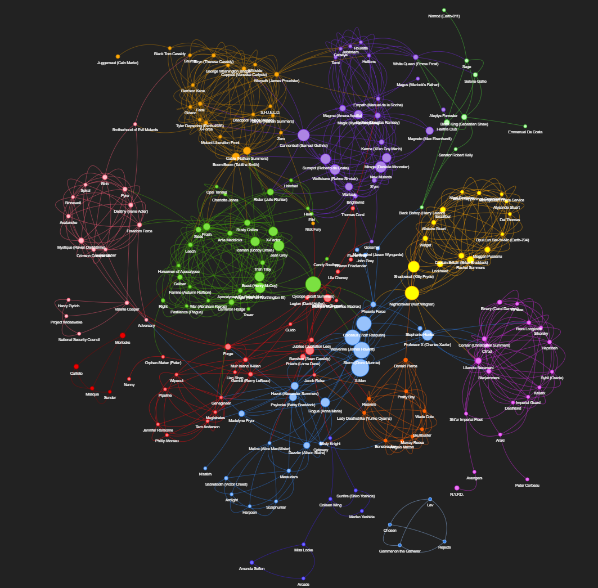

# Portfólio

## 1: Visualização de rede de personagens da Marvel
> Projeto em Python que monta um grafo a partir de dados da [wiki](https://marvel.fandom.com/wiki/Marvel_Database) dos quadrinhos da Marvel. Mostra quais personagens tendem a aparecer juntos mais frequentemente.

Repo: [https://github.com/meee-low/web-of-marvel-characters](https://github.com/meee-low/web-of-marvel-characters)

Grafo interativo: [https://meee-low.github.io/web-of-marvel-characters/output/X-Men_2022-07-26-23-10-49_n200-e890](https://meee-low.github.io/web-of-marvel-characters/output/X-Men_2022-07-26-23-10-49_n200-e890)
### Ferramentas utilizadas:
- Webscraping com **BeautifulSoup 4**
- Manipulação de dados com **Pandas**, com manipulação de strings, números e ferramentas estatísticas
- Grafos e visualização com **networkx** e **pyvis**
- **Jupyter** para storytelling.

## 2: Cronômetro para programas de debate
> Um cronômetro simples na web que permite contar o tempo de fala de múltiplos participantes. Criado para preencher uma necessidade de alguns canais da twitch. Utilizado por [notsoErudite](https://twitch.tv/notsoErudite) e outros canais.

Repo: [https://github.com/meee-low/panel-time-tracker](https://github.com/meee-low/panel-time-tracker)

Web app: [https://meee-low.github.io/panel-time-tracker/main](https://meee-low.github.io/panel-time-tracker/main)

### Ferramentas utilizadas:
- HTML, JavaScript, CSS